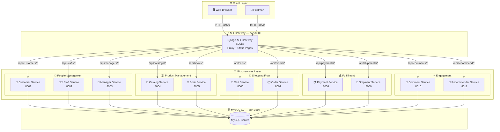
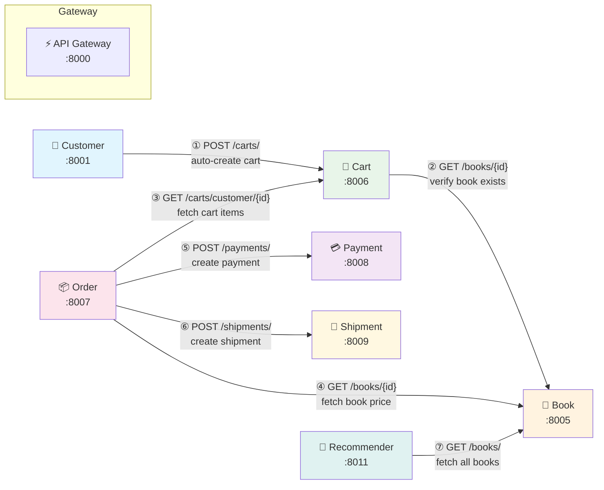
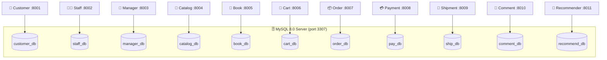
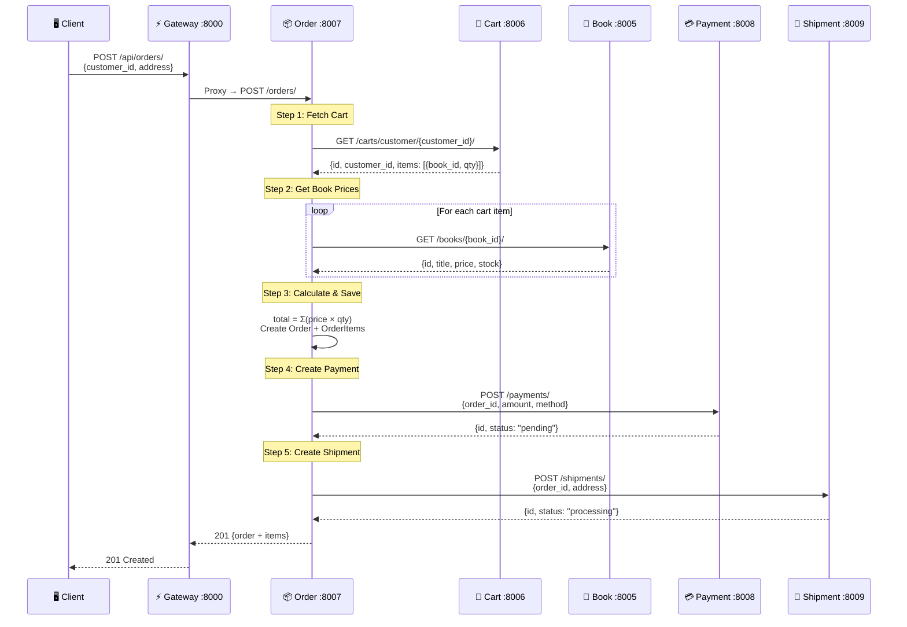
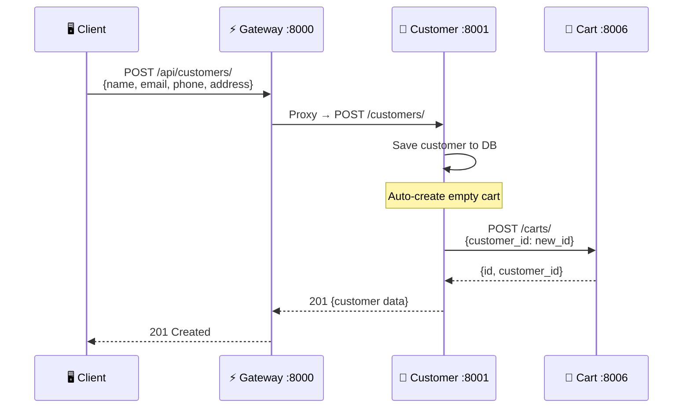

# 📐 BookStore Microservices — Architecture Diagram

---

## 1. High-Level System Architecture



---

## 2. Inter-Service Communication



---

## 3. Database Architecture (Database per Service)



---

## 4. Docker Network Topology

```
┌──────────────────────────────────────────────────────────────────────────────────────────┐
│                            Docker Network: bookstore-net                                 │
│                                                                                          │
│  ┌─────────────────────────────────────────────────────────────────────────────────────┐  │
│  │                         🌐  API Gateway (api-gateway:8000)                          │  │
│  │                         Django 4.2 + SQLite + HTML Templates                        │  │
│  │                         Exposed → localhost:8000                                     │  │
│  └────────┬───────┬───────┬───────┬───────┬───────┬───────┬───────┬───────┬───────┬────┘  │
│           │       │       │       │       │       │       │       │       │       │       │
│    ┌──────▼──┐┌───▼───┐┌──▼────┐┌─▼─────┐┌▼──────┐┌▼─────┐┌▼─────┐┌▼─────┐┌▼─────┐┌▼───┐│
│    │Customer ││ Staff ││Manager││Catalog││ Book  ││ Cart ││Order ││ Pay  ││ Ship ││Comm││
│    │ :8001   ││ :8002 ││ :8003 ││ :8004 ││ :8005 ││ :8006││ :8007││ :8008││ :8009││entd││
│    └───┬─────┘└──┬────┘└──┬────┘└──┬────┘└──┬────┘└──┬───┘└──┬───┘└──┬───┘└──┬───┘└──┬─┘│
│        │         │        │        │        │        │       │       │       │       │   │
│  ┌─────▼─────────▼────────▼────────▼────────▼────────▼───────▼───────▼───────▼───────▼─┐ │
│  │                        🗄️  MySQL 8.0 (mysql:3306)                                   │ │
│  │                        Exposed → localhost:3307                                      │ │
│  │    11 databases: customer_db | staff_db | manager_db | catalog_db | book_db          │ │
│  │                   cart_db | order_db | pay_db | ship_db | comment_db | recommend_db  │ │
│  └─────────────────────────────────────────────────────────────────────────────────────┘ │
│                                                                                          │
│  ┌──────────────────────┐                                                                │
│  │ 🤖 Recommender :8011 │  (also on same network)                                       │
│  └──────────────────────┘                                                                │
└──────────────────────────────────────────────────────────────────────────────────────────┘
```

---

## 5. Request Flow — Order Creation (Business Workflow)



---

## 6. Customer Registration Flow



---

## 7. Technology Stack

```
┌────────────────────────────────────────────────────────────────────┐
│                      🏗️  TECHNOLOGY STACK                          │
├────────────────────────────────────────────────────────────────────┤
│                                                                    │
│  ┌──────────────┐  ┌──────────────┐  ┌──────────────────────────┐ │
│  │   Frontend    │  │  API Gateway │  │      Backend (×11)       │ │
│  ├──────────────┤  ├──────────────┤  ├──────────────────────────┤ │
│  │ HTML5 / CSS3 │  │ Django 4.2   │  │ Django 4.2               │ │
│  │ Bootstrap 5  │  │ SQLite       │  │ Django REST Framework    │ │
│  │ JavaScript   │  │ Requests lib │  │ 3.15.1                   │ │
│  │ Fetch API    │  │ URL Proxy    │  │ MySQL 8.0                │ │
│  └──────────────┘  └──────────────┘  │ mysqlclient              │ │
│                                       └──────────────────────────┘ │
│  ┌──────────────┐  ┌──────────────┐  ┌──────────────────────────┐ │
│  │Infrastructure│  │   Language   │  │       Pattern            │ │
│  ├──────────────┤  ├──────────────┤  ├──────────────────────────┤ │
│  │ Docker       │  │ Python 3.11  │  │ API Gateway Pattern      │ │
│  │ Docker       │  │              │  │ Database per Service     │ │
│  │  Compose     │  │              │  │ Synchronous REST calls   │ │
│  │ MySQL 8.0    │  │              │  │ Service Orchestration    │ │
│  └──────────────┘  └──────────────┘  └──────────────────────────┘ │
└────────────────────────────────────────────────────────────────────┘
```

---

## 8. Port Mapping Summary

| Service | Container Name | Internal Port | External Port | Database |
|---------|---------------|---------------|---------------|----------|
| MySQL | mysql | 3306 | **3307** | — |
| API Gateway | api-gateway | 8000 | **8000** | SQLite |
| Customer | customer-service | 8001 | 8001 | customer_db |
| Staff | staff-service | 8002 | 8002 | staff_db |
| Manager | manager-service | 8003 | 8003 | manager_db |
| Catalog | catalog-service | 8004 | 8004 | catalog_db |
| Book | book-service | 8005 | 8005 | book_db |
| Cart | cart-service | 8006 | 8006 | cart_db |
| Order | order-service | 8007 | 8007 | order_db |
| Payment | pay-service | 8008 | 8008 | pay_db |
| Shipment | ship-service | 8009 | 8009 | ship_db |
| Comment | comment-service | 8010 | 8010 | comment_db |
| Recommender | recommender-service | 8011 | 8011 | recommend_db |

---

## 9. Service Routing Table (Gateway)

```
Client Request                      →  Gateway Proxy Target
─────────────────────────────────────────────────────────────
/api/customers/*                    →  http://customer-service:8001/customers/*
/api/staffs/*                       →  http://staff-service:8002/staffs/*
/api/managers/*                     →  http://manager-service:8003/managers/*
/api/catalogs/*                     →  http://catalog-service:8004/catalogs/*
/api/books/*                        →  http://book-service:8005/books/*
/api/carts/*                        →  http://cart-service:8006/carts/*
/api/cart-items/*                   →  http://cart-service:8006/cart-items/*
/api/orders/*                       →  http://order-service:8007/orders/*
/api/order-items/*                  →  http://order-service:8007/order-items/*
/api/payments/*                     →  http://pay-service:8008/payments/*
/api/shipments/*                    →  http://ship-service:8009/shipments/*
/api/comments/*                     →  http://comment-service:8010/comments/*
/api/recommendations/*              →  http://recommender-service:8011/recommendations/*
/api/recommend/*                    →  http://recommender-service:8011/recommend/*
```

---

> 💡 **Tip**: Các Mermaid diagram có thể xem trực tiếp trên **GitHub**, **GitLab**, hoặc dùng [Mermaid Live Editor](https://mermaid.live) để render.
