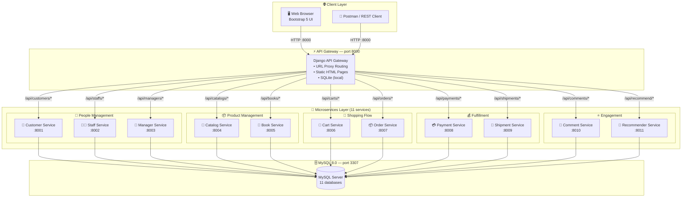
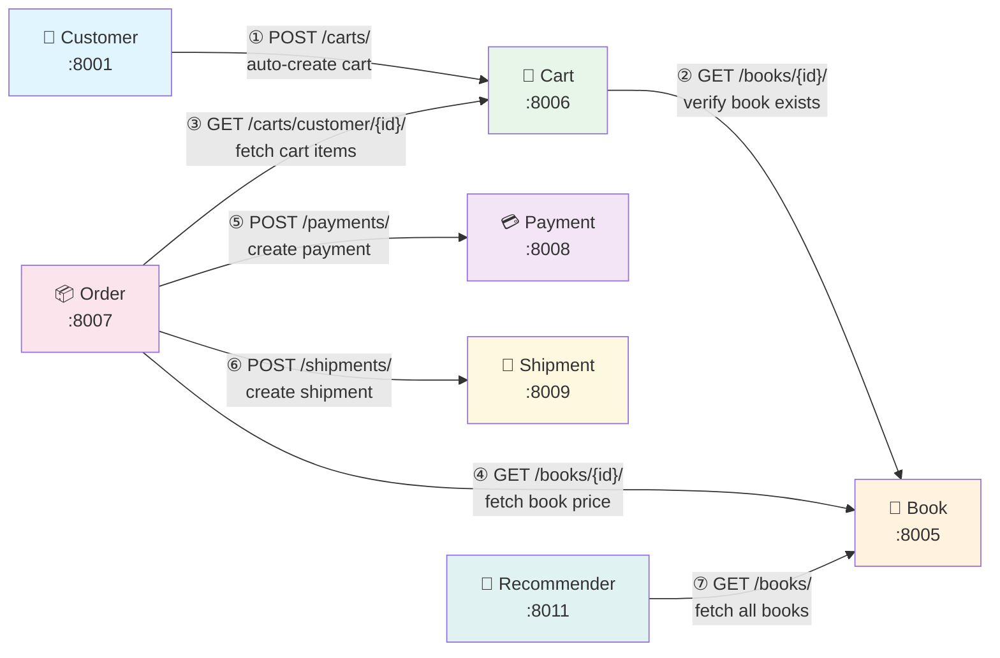
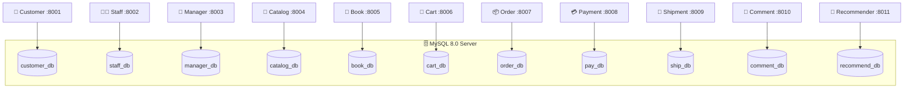
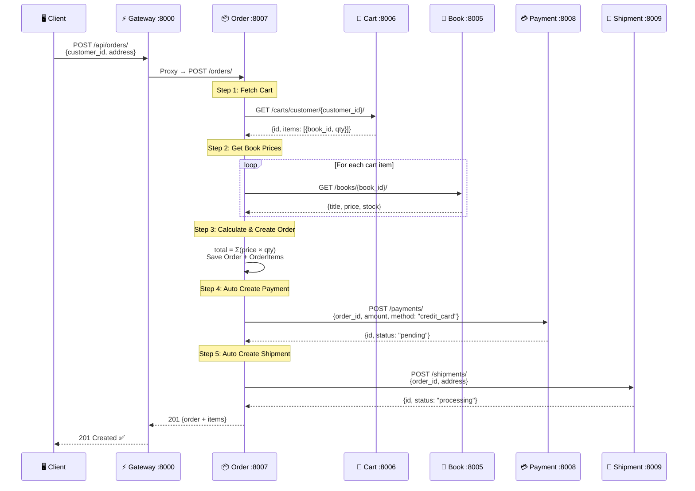
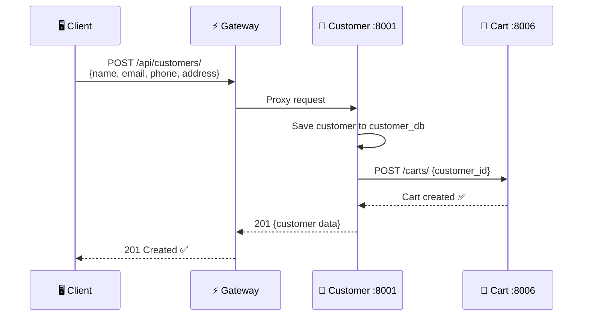

# 📚 BookStore Microservices System

> Hệ thống quản lý nhà sách trực tuyến được xây dựng theo kiến trúc **Microservices**, bao gồm **11 dịch vụ độc lập** + **1 API Gateway**, triển khai bằng **Docker Compose**.

---

## 📋 Mục lục

- [Tổng quan hệ thống](#-tổng-quan-hệ-thống)
- [Sơ đồ kiến trúc](#-sơ-đồ-kiến-trúc)
- [Giao tiếp giữa các Service](#-giao-tiếp-giữa-các-service)
- [Database Architecture](#-database-architecture)
- [Chi tiết từng Service](#-chi-tiết-từng-service)
- [Technology Stack](#️-technology-stack)
- [Cấu trúc thư mục](#-cấu-trúc-thư-mục)
- [Hướng dẫn cài đặt & chạy](#-hướng-dẫn-cài-đặt--chạy)
- [API Endpoints](#-api-endpoints)
- [Business Flow](#-business-flow)
- [Port Mapping](#-port-mapping)
- [Tài liệu bổ sung](#-tài-liệu-bổ-sung)

---

## 🎯 Tổng quan hệ thống

BookStore Microservices là hệ thống quản lý nhà sách online hoàn chỉnh, hỗ trợ:

| Chức năng | Mô tả |
|-----------|-------|
| 👤 Quản lý khách hàng | CRUD khách hàng, tự động tạo giỏ hàng |
| 👨‍💼 Quản lý nhân viên | CRUD nhân viên với vai trò (role) |
| 👔 Quản lý quản lý | CRUD manager theo phòng ban |
| 📂 Quản lý danh mục | Phân loại sách theo thể loại |
| 📖 Quản lý sách | CRUD sách với giá & tồn kho |
| 🛒 Giỏ hàng | Thêm/xóa sách, quản lý số lượng |
| 📦 Đặt hàng | Tạo đơn hàng tự động từ giỏ hàng |
| 💳 Thanh toán | Quản lý thanh toán (credit_card, cash, transfer) |
| 🚚 Vận chuyển | Theo dõi trạng thái giao hàng |
| 💬 Đánh giá | Bình luận & chấm điểm sách (1-5 sao) |
| 🤖 Gợi ý AI | Gợi ý sách ngẫu nhiên cho khách hàng |

---

## 🏗 Sơ đồ kiến trúc

### Kiến trúc tổng thể (High-Level Architecture)



### Docker Network Topology

```
┌──────────────────────────────────────────────────────────────────────────────────────────────┐
│                              Docker Network: bookstore-net                                    │
│                                                                                              │
│  ┌────────────────────────────────────────────────────────────────────────────────────────┐   │
│  │                         🌐  API Gateway (api-gateway:8000)                             │   │
│  │                         Django 4.2 + SQLite + HTML Templates                           │   │
│  │                         Exposed → localhost:8000                                        │   │
│  └──────┬──────┬──────┬──────┬──────┬──────┬──────┬──────┬──────┬──────┬──────────────────┘   │
│         │      │      │      │      │      │      │      │      │      │                     │
│  ┌──────▼─┐┌───▼──┐┌──▼───┐┌─▼────┐┌▼─────┐┌▼────┐┌▼────┐┌▼────┐┌▼────┐┌▼──────┐┌────────┐ │
│  │Customer││Staff ││Mngr  ││Ctlog ││ Book ││Cart ││Order││ Pay ││Ship ││Comment││Recomm. │ │
│  │ :8001  ││:8002 ││:8003 ││:8004 ││:8005 ││:8006││:8007││:8008││:8009││ :8010 ││ :8011  │ │
│  └──┬─────┘└──┬───┘└──┬───┘└──┬───┘└──┬───┘└──┬──┘└──┬──┘└──┬──┘└──┬──┘└──┬────┘└──┬─────┘ │
│     │         │       │       │       │       │      │      │      │      │         │       │
│  ┌──▼─────────▼───────▼───────▼───────▼───────▼──────▼──────▼──────▼──────▼─────────▼─────┐ │
│  │                           🗄️  MySQL 8.0 (mysql:3306)                                   │ │
│  │                           Exposed → localhost:3307                                      │ │
│  │   11 databases: customer_db │ staff_db │ manager_db │ catalog_db │ book_db              │ │
│  │                  cart_db │ order_db │ pay_db │ ship_db │ comment_db │ recommend_db       │ │
│  └────────────────────────────────────────────────────────────────────────────────────────┘ │
└──────────────────────────────────────────────────────────────────────────────────────────────┘
```

---

## 🔗 Giao tiếp giữa các Service

Các microservice giao tiếp với nhau qua **REST API nội bộ** (synchronous HTTP) thông qua Docker network.



| # | Giao tiếp | Mô tả |
|---|-----------|-------|
| ① | Customer → Cart | Khi tạo customer mới, tự động POST tạo giỏ hàng rỗng |
| ② | Cart → Book | Khi thêm sản phẩm vào giỏ, kiểm tra sách có tồn tại |
| ③ | Order → Cart | Lấy tất cả items trong giỏ hàng của customer |
| ④ | Order → Book | Lấy giá sách để tính tổng đơn hàng |
| ⑤ | Order → Payment | Tự động tạo bản ghi thanh toán (pending) |
| ⑥ | Order → Shipment | Tự động tạo bản ghi vận chuyển (processing) |
| ⑦ | Recommender → Book | Lấy danh sách sách để gợi ý ngẫu nhiên |

---

## 🗄 Database Architecture

Mỗi service có **database riêng** (Database per Service pattern), đảm bảo tính độc lập và tách biệt dữ liệu.



### Data Models

#### 👤 Customer
| Field | Type | Ghi chú |
|-------|------|---------|
| id | AutoField | Primary key |
| name | CharField(100) | Tên khách hàng |
| email | EmailField | **Unique** |
| phone | CharField(20) | Số điện thoại |
| address | TextField | Địa chỉ |
| created_at | DateTimeField | Auto |

#### 👨‍💼 Staff
| Field | Type | Ghi chú |
|-------|------|---------|
| id | AutoField | Primary key |
| name | CharField(100) | Tên nhân viên |
| email | EmailField | **Unique** |
| role | CharField(50) | Default: `"staff"` |
| phone | CharField(20) | Số điện thoại |
| created_at | DateTimeField | Auto |

#### 👔 Manager
| Field | Type | Ghi chú |
|-------|------|---------|
| id | AutoField | Primary key |
| name | CharField(100) | Tên quản lý |
| email | EmailField | **Unique** |
| department | CharField(100) | Phòng ban |
| phone | CharField(20) | Số điện thoại |
| created_at | DateTimeField | Auto |

#### 📂 Catalog
| Field | Type | Ghi chú |
|-------|------|---------|
| id | AutoField | Primary key |
| name | CharField(100) | Tên danh mục |
| description | TextField | Mô tả |
| created_at | DateTimeField | Auto |

#### 📖 Book
| Field | Type | Ghi chú |
|-------|------|---------|
| id | AutoField | Primary key |
| title | CharField(200) | Tên sách |
| author | CharField(100) | Tác giả |
| price | DecimalField(10,2) | Giá |
| stock | IntegerField | Default: `0` |
| created_at | DateTimeField | Auto |

#### 🛒 Cart & CartItem

| Field (Cart) | Type | Ghi chú |
|-------|------|---------|
| id | AutoField | Primary key |
| customer_id | IntegerField | ID khách hàng (cross-service) |
| created_at | DateTimeField | Auto |

| Field (CartItem) | Type | Ghi chú |
|-------|------|---------|
| id | AutoField | Primary key |
| cart | ForeignKey(Cart) | FK → Cart |
| book_id | IntegerField | ID sách (cross-service) |
| quantity | IntegerField | Default: `1` |

#### 📦 Order & OrderItem

| Field (Order) | Type | Ghi chú |
|-------|------|---------|
| id | AutoField | Primary key |
| customer_id | IntegerField | ID khách hàng |
| total_amount | DecimalField(10,2) | Tổng tiền |
| status | CharField | `pending` / `paid` / `shipped` / `delivered` / `cancelled` |
| created_at | DateTimeField | Auto |

| Field (OrderItem) | Type | Ghi chú |
|-------|------|---------|
| id | AutoField | Primary key |
| order | ForeignKey(Order) | FK → Order |
| book_id | IntegerField | ID sách |
| quantity | IntegerField | Số lượng |
| price | DecimalField(10,2) | Giá tại thời điểm mua |

#### 💳 Payment
| Field | Type | Ghi chú |
|-------|------|---------|
| id | AutoField | Primary key |
| order_id | IntegerField | ID đơn hàng |
| amount | DecimalField(10,2) | Số tiền |
| method | CharField | `credit_card` / `cash` / `transfer` |
| status | CharField | `pending` / `completed` / `failed` |
| created_at | DateTimeField | Auto |

#### 🚚 Shipment
| Field | Type | Ghi chú |
|-------|------|---------|
| id | AutoField | Primary key |
| order_id | IntegerField | ID đơn hàng |
| address | TextField | Địa chỉ giao |
| status | CharField | `processing` / `shipped` / `delivered` |
| tracking_number | CharField(100) | Mã vận đơn |
| created_at | DateTimeField | Auto |

#### 💬 Comment
| Field | Type | Ghi chú |
|-------|------|---------|
| id | AutoField | Primary key |
| customer_id | IntegerField | ID khách hàng |
| book_id | IntegerField | ID sách |
| content | TextField | Nội dung bình luận |
| rating | IntegerField | 1-5 sao, Default: `5` |
| created_at | DateTimeField | Auto |

#### 🤖 Recommendation
| Field | Type | Ghi chú |
|-------|------|---------|
| id | AutoField | Primary key |
| customer_id | IntegerField | ID khách hàng |
| book_id | IntegerField | ID sách |
| score | FloatField | Điểm gợi ý (0.0 - 1.0) |
| created_at | DateTimeField | Auto |

---

## 📦 Chi tiết từng Service

| # | Service | Port | Database | Mô tả |
|---|---------|------|----------|-------|
| 1 | **Customer Service** | 8001 | customer_db | Quản lý khách hàng, auto-tạo giỏ hàng |
| 2 | **Staff Service** | 8002 | staff_db | Quản lý nhân viên nhà sách |
| 3 | **Manager Service** | 8003 | manager_db | Quản lý quản lý theo phòng ban |
| 4 | **Catalog Service** | 8004 | catalog_db | Quản lý danh mục sách |
| 5 | **Book Service** | 8005 | book_db | Quản lý sách, giá, tồn kho |
| 6 | **Cart Service** | 8006 | cart_db | Giỏ hàng + Cart Items |
| 7 | **Order Service** | 8007 | order_db | Đặt hàng, orchestrate payment & shipment |
| 8 | **Payment Service** | 8008 | pay_db | Thanh toán (credit_card / cash / transfer) |
| 9 | **Shipment Service** | 8009 | ship_db | Vận chuyển, tracking |
| 10 | **Comment & Rate** | 8010 | comment_db | Bình luận & đánh giá sách |
| 11 | **Recommender AI** | 8011 | recommend_db | Gợi ý sách thông minh |
| 12 | **API Gateway** | 8000 | SQLite | Proxy routing + Web UI |

---

## 🛠️ Technology Stack

| Layer | Công nghệ | Phiên bản |
|-------|-----------|-----------|
| **Language** | Python | 3.11 |
| **Backend Framework** | Django | 4.2.11 |
| **REST API** | Django REST Framework | 3.15.1 |
| **Database** | MySQL | 8.0 |
| **DB Client** | mysqlclient | 2.2.4 |
| **HTTP Client** | requests | 2.31.0 |
| **CORS** | django-cors-headers | 4.3.1 |
| **Frontend** | HTML5 + Bootstrap 5 + JavaScript (Fetch API) | — |
| **Container** | Docker + Docker Compose | v3.8 |
| **Architecture** | API Gateway + Database per Service + Service Orchestration | — |

```
┌────────────────────────────────────────────────────────────────────┐
│                      🏗️  TECHNOLOGY STACK                          │
├────────────────────────────────────────────────────────────────────┤
│                                                                    │
│  ┌──────────────┐  ┌──────────────┐  ┌──────────────────────────┐ │
│  │   Frontend    │  │  API Gateway │  │      Backend (×11)       │ │
│  ├──────────────┤  ├──────────────┤  ├──────────────────────────┤ │
│  │ HTML5 / CSS3 │  │ Django 4.2   │  │ Django 4.2               │ │
│  │ Bootstrap 5  │  │ SQLite       │  │ Django REST Framework    │ │
│  │ JavaScript   │  │ Requests lib │  │ 3.15.1                   │ │
│  │ Fetch API    │  │ URL Proxy    │  │ MySQL 8.0                │ │
│  └──────────────┘  └──────────────┘  │ mysqlclient              │ │
│                                       └──────────────────────────┘ │
│  ┌──────────────┐  ┌──────────────┐  ┌──────────────────────────┐ │
│  │Infrastructure│  │   Language   │  │       Pattern            │ │
│  ├──────────────┤  ├──────────────┤  ├──────────────────────────┤ │
│  │ Docker       │  │ Python 3.11  │  │ API Gateway Pattern      │ │
│  │ Docker       │  │              │  │ Database per Service     │ │
│  │  Compose     │  │              │  │ Synchronous REST calls   │ │
│  │ MySQL 8.0    │  │              │  │ Service Orchestration    │ │
│  └──────────────┘  └──────────────┘  └──────────────────────────┘ │
└────────────────────────────────────────────────────────────────────┘
```

---

## 📁 Cấu trúc thư mục

```
bookstore-micro05/
│
├── docker-compose.yml              # Orchestration - 13 containers
├── init.sql                        # Khởi tạo 11 databases
│
├── api-gateway/                    # ⚡ API Gateway (port 8000)
│   ├── Dockerfile
│   ├── manage.py
│   ├── requirements.txt
│   ├── gateway_project/            # Django settings
│   │   ├── settings.py
│   │   └── urls.py
│   ├── gateway/                    # App chính
│   │   ├── views.py                # Proxy logic + page views
│   │   └── urls.py                 # Route definitions
│   └── templates/                  # Frontend HTML
│       ├── index.html              # Trang chủ
│       ├── books.html              # Quản lý sách
│       ├── cart.html               # Giỏ hàng
│       ├── customers.html          # Khách hàng
│       ├── orders.html             # Đơn hàng
│       ├── payments.html           # Thanh toán
│       ├── shipments.html          # Vận chuyển
│       ├── staffs.html             # Nhân viên
│       ├── managers.html           # Quản lý
│       ├── catalogs.html           # Danh mục
│       ├── comments.html           # Đánh giá
│       └── recommender.html        # Gợi ý AI
│
├── customer-service/               # 👤 Customer (port 8001)
│   ├── Dockerfile
│   ├── manage.py
│   ├── requirements.txt
│   ├── customer_project/settings.py
│   └── customers/
│       ├── models.py
│       ├── serializers.py
│       ├── views.py
│       ├── urls.py
│       └── migrations/
│
├── staff-service/                  # 👨‍💼 Staff (port 8002)
├── manager-service/                # 👔 Manager (port 8003)
├── catalog-service/                # 📂 Catalog (port 8004)
├── book-service/                   # 📖 Book (port 8005)
├── cart-service/                   # 🛒 Cart (port 8006)
├── order-service/                  # 📦 Order (port 8007)
├── pay-service/                    # 💳 Payment (port 8008)
├── ship-service/                   # 🚚 Shipment (port 8009)
├── comment-rate-service/           # 💬 Comment (port 8010)
├── recommender-ai-service/         # 🤖 Recommender (port 8011)
│
├── API_DOCUMENTATION.md            # 📖 API Documentation chi tiết
├── ARCHITECTURE_DIAGRAM.md         # 📐 Sơ đồ kiến trúc chi tiết
├── BookStore_API.postman_collection.json  # 🧪 Postman Collection
└── README.md                       # 📋 File này
```

> 💡 Mỗi service có cấu trúc giống nhau: `Dockerfile`, `manage.py`, `requirements.txt`, Django project + app với `models.py`, `serializers.py`, `views.py`, `urls.py`.

---

## 🚀 Hướng dẫn cài đặt & chạy

### Yêu cầu hệ thống

- **Docker** ≥ 20.x
- **Docker Compose** ≥ 2.x
- **RAM** ≥ 4GB (13 containers + MySQL)
- Cổng **8000-8011** và **3307** khả dụng

### Bước 1 — Di chuyển vào thư mục

```bash
cd bookstore-micro05
```

### Bước 2 — Build & khởi chạy

```bash
docker-compose up --build -d
```

> ⏳ Lần đầu sẽ mất ~3-5 phút để build image + khởi tạo MySQL.

### Bước 3 — Kiểm tra trạng thái

```bash
docker-compose ps
```

Tất cả 13 containers phải ở trạng thái **Up**:

```
NAME                         STATUS
mysql                        Up (healthy)
customer-service             Up
staff-service                Up
manager-service              Up
catalog-service              Up
book-service                 Up
cart-service                 Up
order-service                Up
pay-service                  Up
ship-service                 Up
comment-rate-service         Up
recommender-ai-service       Up
api-gateway                  Up
```

### Bước 4 — Chạy migrations (lần đầu)

```bash
for svc in customer-service staff-service manager-service catalog-service \
  book-service cart-service order-service pay-service ship-service \
  comment-rate-service recommender-ai-service; do
  docker-compose exec $svc python manage.py makemigrations
  docker-compose exec $svc python manage.py migrate
done
```

### Bước 5 — Truy cập

| URL | Mô tả |
|-----|-------|
| http://localhost:8000 | 🏠 Trang chủ (Web UI) |
| http://localhost:8000/api/books/ | 📖 API Books (JSON) |
| http://localhost:8000/pages/books.html | 📖 Trang quản lý sách |

### Dừng hệ thống

```bash
docker-compose down          # Dừng containers (giữ data)
docker-compose down -v       # Dừng + xóa toàn bộ data (volumes)
```

---

## 📡 API Endpoints

> **Base URL:** `http://localhost:8000/api`

### CRUD APIs (tất cả hỗ trợ GET / POST / PUT / PATCH / DELETE)

| Service | List & Create | Detail |
|---------|--------------|--------|
| 👤 Customer | `GET/POST /api/customers/` | `/api/customers/{id}/` |
| 👨‍💼 Staff | `GET/POST /api/staffs/` | `/api/staffs/{id}/` |
| 👔 Manager | `GET/POST /api/managers/` | `/api/managers/{id}/` |
| 📂 Catalog | `GET/POST /api/catalogs/` | `/api/catalogs/{id}/` |
| 📖 Book | `GET/POST /api/books/` | `/api/books/{id}/` |
| 🛒 Cart | `GET /api/carts/` | `/api/carts/{id}/` |
| 🛒 CartItem | `GET/POST /api/cart-items/` | `/api/cart-items/{id}/` |
| 📦 Order | `GET/POST /api/orders/` | `/api/orders/{id}/` |
| 📦 OrderItem | `GET /api/order-items/` | `/api/order-items/{id}/` |
| 💳 Payment | `GET/POST /api/payments/` | `/api/payments/{id}/` |
| 🚚 Shipment | `GET/POST /api/shipments/` | `/api/shipments/{id}/` |
| 💬 Comment | `GET/POST /api/comments/` | `/api/comments/{id}/` |
| 🤖 Recommendation | `GET/POST /api/recommendations/` | `/api/recommendations/{id}/` |

### Custom Endpoints

| Endpoint | Method | Mô tả |
|----------|--------|-------|
| `/api/carts/customer/{customer_id}/` | GET | Lấy giỏ hàng theo customer ID |
| `/api/recommend/` | GET | Gợi ý sách ngẫu nhiên (AI) |

### Ví dụ Request

**Tạo khách hàng:**
```bash
curl -X POST http://localhost:8000/api/customers/ \
  -H "Content-Type: application/json" \
  -d '{"name":"Nguyen Van A","email":"a@gmail.com","phone":"0901234567","address":"Ha Noi"}'
```

**Tạo sách:**
```bash
curl -X POST http://localhost:8000/api/books/ \
  -H "Content-Type: application/json" \
  -d '{"title":"Dune","author":"Frank Herbert","price":"15.99","stock":50}'
```

**Tạo đơn hàng (auto: cart → book → payment → shipment):**
```bash
curl -X POST http://localhost:8000/api/orders/ \
  -H "Content-Type: application/json" \
  -d '{"customer_id":1,"address":"123 Nguyen Hue, HCM"}'
```

---

## 🔥 Business Flow

### Luồng đặt hàng hoàn chỉnh



### Luồng đăng ký khách hàng



### Tóm tắt Business Flow

```
1. 👤 Tạo Customer  →  🛒 Auto-tạo Cart rỗng
2. 📖 Tạo Books     →  Thêm sách vào hệ thống
3. 🛒 Add CartItem  →  Thêm sách vào giỏ (verify book tồn tại)
4. 📦 Create Order  →  Fetch cart → Fetch prices → Create order
                    →  💳 Auto-tạo Payment (pending)
                    →  🚚 Auto-tạo Shipment (processing)
5. 💬 Add Comment   →  Đánh giá sách (1-5 sao)
6. 🤖 Recommend     →  Gợi ý sách cho khách hàng
```

---

## 🔌 Port Mapping

| Service | Container | Internal | External | Database |
|---------|-----------|----------|----------|----------|
| MySQL | mysql | 3306 | **3307** | All 11 DBs |
| API Gateway | api-gateway | 8000 | **8000** | SQLite |
| Customer | customer-service | 8001 | 8001 | customer_db |
| Staff | staff-service | 8002 | 8002 | staff_db |
| Manager | manager-service | 8003 | 8003 | manager_db |
| Catalog | catalog-service | 8004 | 8004 | catalog_db |
| Book | book-service | 8005 | 8005 | book_db |
| Cart | cart-service | 8006 | 8006 | cart_db |
| Order | order-service | 8007 | 8007 | order_db |
| Payment | pay-service | 8008 | 8008 | pay_db |
| Shipment | ship-service | 8009 | 8009 | ship_db |
| Comment | comment-rate-service | 8010 | 8010 | comment_db |
| Recommender | recommender-ai-service | 8011 | 8011 | recommend_db |

### Gateway Routing Table

```
Client Request                      →  Internal Proxy Target
═══════════════════════════════════════════════════════════════
/api/customers/*                    →  http://customer-service:8001/customers/*
/api/staffs/*                       →  http://staff-service:8002/staffs/*
/api/managers/*                     →  http://manager-service:8003/managers/*
/api/catalogs/*                     →  http://catalog-service:8004/catalogs/*
/api/books/*                        →  http://book-service:8005/books/*
/api/carts/*                        →  http://cart-service:8006/carts/*
/api/cart-items/*                   →  http://cart-service:8006/cart-items/*
/api/orders/*                       →  http://order-service:8007/orders/*
/api/order-items/*                  →  http://order-service:8007/order-items/*
/api/payments/*                     →  http://pay-service:8008/payments/*
/api/shipments/*                    →  http://ship-service:8009/shipments/*
/api/comments/*                     →  http://comment-service:8010/comments/*
/api/recommendations/*              →  http://recommender-service:8011/recommendations/*
/api/recommend/*                    →  http://recommender-service:8011/recommend/*
```

---

## 📝 Design Principles

| Principle | Cách áp dụng |
|-----------|-------------|
| **Single Responsibility** | Mỗi service chỉ quản lý 1 domain (Customer, Book, Order,...) |
| **Database per Service** | 11 database riêng biệt, không chia sẻ schema |
| **API Gateway Pattern** | Tất cả request đi qua 1 entry point duy nhất (port 8000) |
| **Service Orchestration** | Order Service điều phối Cart → Book → Payment → Shipment |
| **Loose Coupling** | Services liên kết qua ID (customer_id, book_id), không FK trực tiếp |
| **Independent Deployment** | Mỗi service có Dockerfile riêng, build & deploy độc lập |

---

## 📄 Tài liệu bổ sung

| File | Mô tả |
|------|-------|
| [API_DOCUMENTATION.md](API_DOCUMENTATION.md) | 📖 Tài liệu API chi tiết — tất cả endpoints, request/response JSON mẫu |
| [ARCHITECTURE_DIAGRAM.md](ARCHITECTURE_DIAGRAM.md) | 📐 Sơ đồ kiến trúc chi tiết (9 diagrams) |
| [BookStore_API.postman_collection.json](BookStore_API.postman_collection.json) | 🧪 Postman Collection — 50+ requests, full workflow test |

### Import Postman Collection

1. Mở **Postman** → **Import** → chọn `BookStore_API.postman_collection.json`
2. Base URL đã set sẵn: `http://localhost:8000/api`
3. Chạy folder **🔥 FULL WORKFLOW TEST** để test end-to-end

---

> 💡 **Tip**: Các Mermaid diagram xem trực tiếp trên **GitHub**, **GitLab**, hoặc VS Code với extension **Markdown Preview Mermaid Support**.

<p align="center">
  <b>📚 BookStore Microservices System</b><br/>
  Built with ❤️ using Django + Docker + MySQL
</p>
